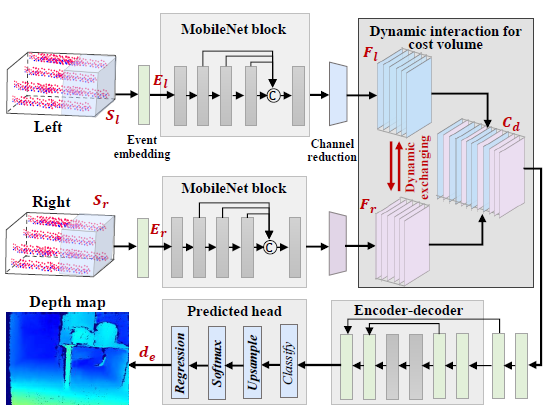

# ActiveEventNet

ActiveEventNet ([CVPR 2025](https://openaccess.thecvf.com/content/CVPR2025/html/Li_Active_Event-based_Stereo_Vision_CVPR_2025_paper.html)) is a lightweight neural network that performs active event-based stereo matching by fusing data from binocular event cameras with an infrared projector for high-speed depth sensing.


<p align="center" width="50%">

</p>


# Installation

- **Create Conda Enviroment**

```
conda create -n ActiveEventNet python=3.8
conda activate ActiveEventNet
```

- **Install Requirements**
```
conda install pytorch==1.12.3 torchvision==0.13.1 torchaudio==0.12.1 cudatoolkit=11.3 -c pytorch
```

# Usage
All following operations are performed on the simulated dataset. The same procedures apply to the real dataset.

### 🌟 ***Preparation Instructions***

1. **Download the dataset**

* Download the **_RealSense-Event-Sim_** on the [simulated dataset project website](https://openi.pcl.ac.cn/LiDianze/PKU-DAVIS-SOD/datasets).

* Download the **_Active Event-based Stereo_** on the [real-world dataset project website](https://openi.pcl.ac.cn/LiDianze/PKU-DAVIS-SOD/datasets).


2. **Execute the dataset preprocessing script**

```
cd /store/ljn/active_event_stereo_dataset/code/
python3 read_sequences.py
```
&nbsp;**Note**: "/store/ljn/active_event_stereo_dataset/code/" is the dataset path, please change to your default path.


3. **Copy the dataset's .txt files**
```
cp -r /store/ljn/active_event_stereo_dataset/code/dataset_filenames/ ./filenames/AES/
```

### Training
First, set the filepath of the RealSense-Event-Sim dataset (e.g., $DATAPATH). Then, run  ```train.py``` as:
```
CUDA_VISIBLE_DEVICES=0 python3 train.py --dataset eventstereo --logdir ./logdir/ --datapath /store/ljn/active_event_stereo_dataset/ --trainlist ./filenames/AES/train_event_npys.txt --testlist ./filenames/AES/test_event_npys.txt --epochs 50 --lrepochs "10,12,14,16:2"
```

### Testing
Run ```test.py``` to evaluate the RealSense-Event-Sim dataset as:
```
CUDA_VISIBLE_DEVICES=0 python3 test.py --datapath /store/ljn/active_event_stereo_dataset/ --testlist ./filenames/AES/test_event_npys.txt --loadckpt ./logdir/best.ckpt --dataset eventstereo --model AENet2D --batch_size 16
```

### Pretrained Models

1. **Pretrained weights on the RealSense-Event-Sim dataset**

<div align="center">

| name | Event representation | resolution |EPE | RMSE | D1-all | Weights |
|:---:|:---:|:---:|:---:| :---:|:---:|:---:|
| ActiveEventNet-Sim | Event image | 640x480 | 1.223 | 2.320  | 0.070 | [ckpt](https://github.com/jianing-li/active_event_based_stereo/tree/main/ActiveEventNet) |

</div>


2. **Pretrained weights on the Active Event-based Stereo dataset**

<div align="center">

| name | Event representation | resolution |EPE | RMSE | D1-all | Weights |
|:---:|:---:|:---:|:---:| :---:|:---:|:---:|
| ActiveEventNet-Real | Event image | 346x340 | 1.993 | 7.821  | 0.083 | [ckpt](https://github.com/jianing-li/active_event_based_stereo/tree/main/ActiveEventNet) |

</div>


# Citation

If the code and paper help your research, please kindly cite:

```
@inproceedings{li2025active,
  title={Active event-based stereo vision},
  author={Li, Jianing and Zhang, Yunjian and Han, Haiqian and Ji, Xiangyang},
  booktitle={Proceedings of the Computer Vision and Pattern Recognition Conference},
  pages={971--981},
  year={2025}
}
```


# License
This project is primarily distributed under the ```Apache License 2.0```.


## Related Repositories
1. [MobileNetV2: Inverted Residuals and Linear Bottlenecks](https://github.com/tonylins/pytorch-mobilenet-v2?tab=readme-ov-file), CVPR 2018.
2. [MobileStereoNet: Towards Lightweight Deep Networks for Stereo Matching](https://openaccess.thecvf.com/content/WACV2022/papers/Shamsafar_MobileStereoNet_Towards_Lightweight_Deep_Networks_for_Stereo_Matching_WACV_2022_paper.pdf), WACV 2022.
