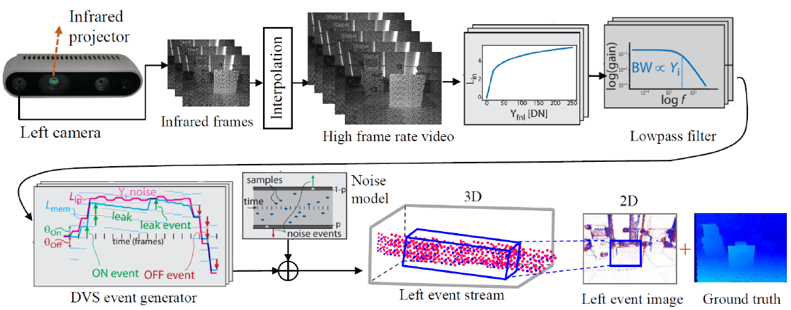

<p align="center">
<h1 align="center"><strong>Active Event-based Stereo Vision</strong></h1>
  <p align="center">
  </p>
</p>

🌟🌟🌟 ***News***: The conference version "[Active Event-based Stereo Vision](https://openaccess.thecvf.com/content/CVPR2025/html/Li_Active_Event-based_Stereo_Vision_CVPR_2025_paper.html)" is accepted by IEEE CVPR 2025. This work presents a novel problem setting, termed \emph{active event-based stereo vision}, which is the first trial to integrate infrared structured light and binocular event cameras for ultra-high-speed dense depth sensing. [**Code Link**: AcitveEventNet](https://github.com/jianing-li/active_event_based_stereo/tree/main/ActiveEventNet)

🌟🌟🌟 ***Note***: The Journal version "**Towards Ultrafast Depth Sensing Via Active Event-based Stereo Vision**" is currently under review by IEEE Journal. This extended version implements an efficient temporal consistency architecture in ActiveEventNet to fully utilize the rich temporal cues in event streams, achieving a good balance between accuracy and speed. [**Code Link**: ActiveEventNet+](https://github.com/jianing-li/active_event_based_stereo/tree/main/Temporal_ActiveEventNet)


## Motivation
Our active event-based stereo camera system integrates binocular event cameras and an infrared 2D pattern laser for high-speed depth sensing.
<p align="center" width="70%">

</p>


## Dataset
- **RealSense-Event-Sim**

An Intel RealSense depth sensor is first used to capture 119 infrared video sequences at a resolution of 640×480, covering variations in velocity, lighting conditions, and scene diversity. These videos are then converted into event streams using the V2E simulator. The synthetic dataset provides stereo event streams along with 23.8k synchronized labels. We split the dataset into 16k samples for training, 3.8k for validation, and 4k for testing.

Download the **_simulated dataset_** on the [dataset project website](https://github.com/jianing-li/active_event_based_stereo/).

<p align="center" width="75%">

</p>


- **Active Event-based Stereo**

The real-world Active-Event-Stereo dataset captures challenging indoor and outdoor scenes. It includes **85 sequences** with synchronized stereo event streams, RGB frames, infrared frames, and depth maps (**15 Hz**, recorded with a RealSense D455). The dataset provides **21.5k** labeled samples, split into 14.6k for training, 3.6k for validation, and 3.3k for testing.

Download the **_real-world dataset_** on the [dataset project website](https://github.com/jianing-li/active_event_based_stereo/).

<p align="center" width="75%">

</p>


## Evaluation

- **ActiveEventNet**

ActiveEventNet presents a lightweight yet effective solution for active event-based stereo matching, with evaluation results presented at CVPR 2025. The implementation code is available for download as:
```
git clone https://github.com/jianing-li/active_event_based_stereo.git ActiveEventNet
```
For detailed usage, please visit [**project page**: AcitveEventNet](https://github.com/jianing-li/active_event_based_stereo/tree/main/ActiveEventNet).


- **ActiveEventNet+**

ActiveEventNet+ extends our original framework with an efficient temporal consistency module, designed to fully exploit the rich temporal cues in stereo event streams while maintaining an optimal balance between accuracy and computational efficiency.
The code is available for download as:
```
git clone https://github.com/jianing-li/active_event_based_stereo.git ActiveEventNet+
```
For more details and scripts:, please check [**project page**: AcitveEventNet+](https://github.com/jianing-li/active_event_based_stereo/tree/main/ActiveEventNet+).


## Citation

If the code and paper help your research, please kindly cite:

```
@inproceedings{li2025active,
  title={Active event-based stereo vision},
  author={Li, Jianing and Zhang, Yunjian and Han, Haiqian and Ji, Xiangyang},
  booktitle={Proceedings of the IEEE/CVF Conference on Computer Vision and Pattern Recognition},
  pages={971--981},
  year={2025}
}
```
