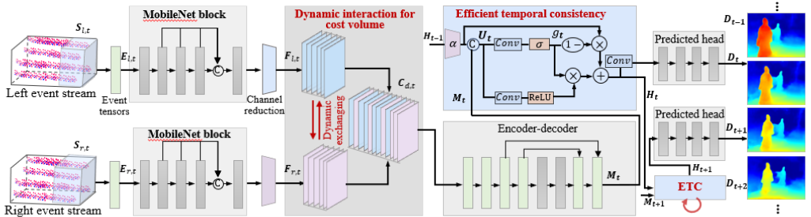

# ActiveEventNet+


Building on ActiveEventNet ([CVPR 2025](https://openaccess.thecvf.com/content/CVPR2025/html/Li_Active_Event-based_Stereo_Vision_CVPR_2025_paper.html)), ActiveEventNet+ introduces an efficient temporal consistency architecture that effectively exploit rich spatiotemporal cues from stereo event streams.

<p align="center" width="100%">

</p>


# Installation

- **Create Conda Enviroment**

```
conda create -n Temporal_ActiveEventNet python=3.8
conda activate Temporal_ActiveEventNet
```

- **Install Requirements**
```
conda install pytorch==1.12.3 torchvision==0.13.1 torchaudio==0.12.1 cudatoolkit=11.3 -c pytorch
```

# Usage
All following operations are performed on the simulated dataset. The same procedures apply to the real dataset.

### 🌟 ***Preparation Instructions***

1. **Download the dataset**

* Download the **_RealSense-Event-Sim_** on the [simulated dataset project website](https://github.com/jianing-li/active_event_based_stereo/).

* Download the **_Active Event-based Stereo_** on the [real-world dataset project website](https://github.com/jianing-li/active_event_based_stereo/).


2. **Execute the dataset preprocessing script**

```
cd /store/ljn/active_event_stereo_dataset/code/
python3 read_sequences.py
```
&nbsp;**Note**: "/store/ljn/active_event_stereo_dataset/code/" is the dataset path, please change to your default path.


3. **Copy the dataset's .txt files**
```
cp -r /store/ljn/active_event_stereo_dataset/code/dataset_filenames/ ./filenames/AES/
```

### Training
&nbsp;**Note**: Our extended journal paper "**Towards Ultrafast Depth Sensing Via Active Event-Based Stereo Vision**" is currently under review at the IEEE Journal. The complete training code (```train.py```) will be released upon formal acceptance.


### Testing
Run ```test.py``` to evaluate the RealSense-Event-Sim dataset as:
```
CUDA_VISIBLE_DEVICES=0 python3 test.py --datapath /store/ljn/active_event_stereo_dataset/ --testlist ./filenames/AES/test_event_npys.txt --loadckpt ./logdir/best.ckpt --dataset eventstereo --model AENet2D --batch_size 16 --temporal_sequence_length 3
```

### Pretrained Models

1. **Pretrained weights on the RealSense-Event-Sim dataset**

<div align="center">

| name | Temporal architecture | Temporal aggregation length |resolution |EPE | RMSE | D1-all | Weights |
|:---:|:---:|:---:|:---:|:---:| :---:|:---:|:---:|
| Temporal-ActiveEventNet-Sim | ETC | T=3 |640x480 | 1.077 | 2.078  | 0.056 | [ckpt](https://github.com/jianing-li/active_event_based_stereo/tree/main/ActiveEventNet+) |

</div>

2. **Pretrained weights on the Active Event-based Stereo dataset**

<div align="center">

| name | Temporal architecture | Temporal aggregation length |resolution |EPE | RMSE | D1-all | Weights |
|:---:|:---:|:---:|:---:|:---:| :---:|:---:|:---:|
| Temporal-ActiveEventNet-Real | ETC | T=2 |346x260 | 1.890 | 7.812  | 0.082 | [ckpt](https://github.com/jianing-li/active_event_based_stereo/tree/main/ActiveEventNet+) |
| Temporal-ActiveEventNet-Real | ETC | T=3 |346x260 | 1.849 | 7.787  | 0.073 | [ckpt](https://github.com/jianing-li/active_event_based_stereo/tree/main/ActiveEventNet+) |
| Temporal-ActiveEventNet-Real | ETC | T=4 |346x260 | 1.829 | 7.792  | 0.072| [ckpt](https://github.com/jianing-li/active_event_based_stereo/tree/main/ActiveEventNet+) |
| Temporal-ActiveEventNet-Real | ETC | T=6 |346x260 | 1.782 | 7.761  | 0.071| [ckpt](https://github.com/jianing-li/active_event_based_stereo/tree/main/ActiveEventNet+) |

</div>


# License
This project is primarily distributed under the ```Apache License 2.0```.
